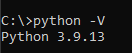
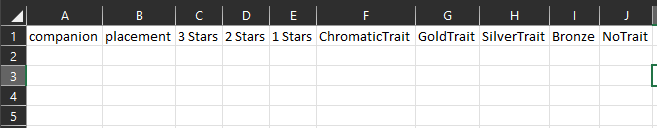

# A Beginner’s Guide to Downloading TFT game information with Python

### Table of Contents:
#### 1.)	Installing python & Ubuntu
#### 2.)	Getting a Riot API key
#### 3.)	Finding a starting GameID
#### 4.)	Running the download program
--These first four steps cover actually GETTING the data. You will end up with a folder filed with JSON files, one for each downloaded game. If you’re working with a database that accepts JSONs, you’re pretty much ready to go! If you’re trying to do analysis with something that requires tables (Like Excel, Tableau, or SQL) then you’ll need to do a couple more steps to get these JSON files into tables that you can use—
#### 5.) TFT JSON file overview
#### 6.) Determining a table format
#### 7.) Creating a CSV through Python
#### 8.) Running the CSV program
#### 9.) Doing some basic analysis

### Part 1: Installing Python

IF YOU ARE ON WINDOWS: (If you know you have python installed you may skip this step) Open up the command line by right clicking on the windows button and selecting “Run”. In the command line, you’ll want to type `cd C:\` and hit enter. From there type `python -V`.

 
*Looks like I’m running version 3.9.13*

 One of two things will happen. 1.) It will return the python version, meaning that python is installed and you’re ready to proceed to the next step, or 2.) it will not detect a python version, and instead open the windows store prompt. Just click the download button and it should install automatically. If either of these methods fail ( you can check again using the `python -V` command) then go directly to https://www.python.org/downloads/ and grab the latest version for Windows.
IF YOU ARE ON MAC: The above method may not necessarily work (I do not own a mac). I would recommend just going to https://www.python.org/downloads/ directly to download the macOS version and running it.

### Part 2: Getting a Riot API key

Go to https://developer.riotgames.com/ and sign in with your league account, or make an account if you don’t have one. You’re looking to get a current API key, which is a code that will allow your python program to make requests from the Riot servers.   

If it says that your code is expired, go to the bottom of the page and click “Regenerate API Key”. Each code only lasts for 24 hours before you need to make a new one, so if you’re running the program multiple times on different days you’ll need to get a new one each time. Also, don’t try to share the code with other people.

With the code in hand you’re going to download the above folder (if you haven’t already) and go to the **apikey.txt** file. This file is intentionally blank: you’re going to paste your specific API key from the riot website here, save it, and close it. 

### Part 3: Finding a starting GameId

Technically the code works as it currently stands! Running it will pull games into **downloads/matches/** however it will be pulling random games from patch 12.12 and later. How it works is based off of the game ID put into the **starterID.txt file**. The program will only pull games that happened AFTER the original one in the starter file, so if you put a game from the current patch in, you will only get games from the current patch out. Using the default gameID that I included will included many games from older patches, as it is from patch 12.12. If you’re looking to evaluate older patches, feel free to run it as-is, as the program will sort each patch’s game into a separate folder. 

 
 If your end goal is to only get games from the current patch, you should get a gameID from this patch to work with.
The easiest way to do this is to go to https://tactics.tools/player and enter your own profile information in. Scroll down to match history and find a game from the patch you would like to start with (if you have multiple games per patch, try to select the earliest one). This website lets you identify what patch the game took place in pretty easily. 

Once you have the game you want, click the lobby button on the righthand side. This will expand the game information, and also change the web address to include the gameID.

This was my most recent game at the time. Going Ragewing + Shimmerscale was a mistake 😐
The section after your username is the game ID, which you can copy and paste into the **starterID.txt file**. With this, you are ready to actually run the download code.

### Part 4:  Running the download code

Open up your command line, and navigate to the folder this repository is downloaded to. If you have it in your desktop, for example, the command would be something like `cd desktop\TFT-Data_Download` . Once you’re there, all you have to do is type `python download_tft.py`. From there, the command line should start downloading games into the downloads folder (it will show a counter to let you know how many games you have). Each game will be saved as a different JSON file. If you’re planning to do analysis using tools that accept JSONs, like MongoDB, then you’re all set! I hope this guide was helpful. 
For everyone else, the next steps will cover how to transform these individual JSONs into one (or more!) large CSV file(s) that you can use for analysis. This will require some planning as well as picking and choosing what data exactly we want to pull out to analyze.

### Part 5: TFT JSON overview

Assuming you’ve continued on in the guide because you want something easier to analyze than a folder with thousands of JSONs; our next step is going to be to extract values from all the JSONs, and put them into a CSV table format (that can be used with Excel, SQL, Tableau, or most other analytic programs). To do that you’re going to need to do a little planning—you need to know in advance what your CSV fields are going to be, and to do THAT you’ll need to know exactly what data is available to pull out, and what data is not.
I have created a diagram representing each JSONs file structure to help illustrate the contents of each file:

A quick key to understanding the diagram: 

Words in RED: non-callable attributes. For example, trying to reference `["info"]` will return an error, since it is a dictionary. Instead you’d need to reference something inside info, like the game length, using syntax `["info"]["game_length"]`
If the word in red has a dropdown of numbers next to it, that means it’s a list, that must be referenced by a number. For example, `…["augments"][0]` would return a string containing the first augment selected (remember that lists in python count starting at 0 instead of starting at 1). Some lists contain dictionaries, and need more than a number to reference. For example, `…["traits"][2]["character_id"]` would reference the third unit a particular player had and return its character ID. 

Words in BLACK: callable attributes. Referencing something in black will return its value, usually a string or an integer. There are a few special attributes that aren’t strings or integers so be careful. Example: `["info"]["participants"][0]["placement"]` will return the integer specifying how the first player in the list placed. It is worth noting that the players are NOT listed by order of how they placed, so `["participant"][0]` is not necessarily the one who came in first.

Each of the fields in the diagram are mostly self explanatory, but if anything is not clear, head to https://developer.riotgames.com/apis#tft-match-v1/GET_getMatchIdsByMatchID  and click on the second bar, that says matches by matchID. It contains a fully documented list of all variables, what they contain, and what they are nested under. The only thing that I think is important to know is that rarity doesn’t go from 1 to 5 like the costs in the TFT shop do—instead, most units will be placed in a 0 to 4 scale, with dragon units, target dummies, and the trainer Nomsy units having special rarities beyond 0 to 4. For example, Nomsy is listed as a unit with rarity 8.

### Part 6: Determining a table format

Find the variables in advance that you would like to turn into a table, as you can’t have nested attributes in most basic visualization software. To do this, I would recommend opening excel or google docs and just typing out some headings for what you want in your dataset.

I’m going to walk through an example where for each given user, I’m looking at the companion, their placement, how many 3, 2 and 1 star units they had when they died, as well as how many traits at the Chromatic, Gold, silver and bronze badge levels. I’m also looking at how many unactivated traits they had (for example, having only 2 ragewings so that the effect is not active).

Remember, when designing your format, you aren’t limited to just the literal contents of the files—you can average and aggregate numbers, or make counts with lists. It will help to have a specific idea of what you want to analyze.

### Part 7: Creating a CSV through Python

You’re going to need to do a little coding in this step. 

The first change you’ll need to make is to the `MyDir` variable at the top. All you need to do is replace the default value with the address of the folder containing all the TFT games. Simply navigate to it in file explorer, and right click the address bar at the top. Click copy address, and paste it over the default value.

The `with open` statement doesn’t need to be changed, but note that it specifies what the name of the output file will be—in the default case, **tftcsv.csv**. If you want to create multiple CSVs for making a relational database, you'll need to change the output name each time so that it doesn't overwrite the original.
On line 10 is the first big change you’ll need to make. You’ll need to list out each of the headings for the CSV file, the same ones you created in step 6 for the file format. Make sure you follow the syntax, with each heading surrounded by quotation marks, and separated by commas.
On line 12, there’s a filter that lets us determine the game type. In my project, I’m going to filter out only the games of Hyper Roll (which is listed in the JSON under tft_game_type as **turbo** mode.) 
The three types of games are **standard**, **turbo**, and **pairs**, for standard, hyper roll, and double up, respectively. If you don’t want to filter by gamemode you can take this section of the code out. 

*I made this graph of different gamemodes when I was determining the in-file names for each gamemode.*
Everything else in this section should be left as it is—it defines each unique file as variable j and will iterate through all files in the folder address supplied at the top.

Next we’re going to hop to the middle of the code.  

 
 
`for i in range(8):` is going to run any indented code below it eight times. Our code wants to take information from all eight players, so that’s perfect. Our syntax is `j[“info”][“participants”][i]`, followed by whatever attributes we wish to call. You can also “bookmark” attributes by defining a variable at an attribute position. 
`units =  j[“info”][“participants”][i][“units”]` lets me jump down to the **unit** information in my following code without specifying the attribute path. **UnitList** is an empty list that I initialize to store all the tier information in the units section. After running the for loop below it, it ends up populated with integers 0,1, and 2, with each one representing a unit of that star level. The **TraitsList** section works in the same way.

 
 
Jumping to the bottom of the file, this code is what specifies what will be written to each column in a given row. Each iteration of this section produces a new row, and for organization purposes, I have made each column on a new line. At the top is the statement that will record the companion and placement data directly by referencing those attributes. For the other ones, they will be accessed from the lists we created, returning the count for each specified number.

### Part 8: Running the CSV program

This part should be fairly simple! Simply return to your command line, or whatever terminal you use (I use ubuntu for windows) and use the change directory commands to navigate to the location of `create_csv.py`. Once you have, simply type `python3 create_csv.py`, and the program will run.

And just like that, my code has been run! After running it, the new .csv file should show up in the same folder as the **create_csv.py** file. I opened mine up and it seemed mostly fine, with one problem…
 

I referenced **companion** directly, which you’re not supposed to do because it’s a list of dictionaries! As a result, each companion field is a long string with all the lower data inside of it. This isn’t really useful to use as we want to be able to group things by the actual little legend type. To fix this, I went back in the code and changed it to as follows:

If I rerun this it will give use the in-game names for little legends and chibi champions, instead of that big string with multiple fields in it.

### Part 9: Basic Analysis

Now that you’re here, go wild! I’ve used datasets from Teamfight tactics for several different projects in college—building regression models in R, or practicing making graphs in Tableau. I don’t intend to cover too much of those, as there are plenty of guides non-specific to TFT on how to do that. One thing that MAY be added to this guide is how to create a relational database with all pieces from the JSON (so you’re no longer picking and choosing what to pull out into one CSV) and putting it into SQL. Last time I created a SQL database with TFT data it was a pretty messy process, and I don’t intend to make a guide if it’s too complicated for a beginner to follow.
 
 As a final demonstration, I threw my data into a PivotTable in Excel and made a quick profile of average values for people who took first place—in other words, the “average” first place finish in hyper roll. 
 
 

Big thanks to @evangambit for writing the original Python for downloading tft files, and setting me on the path to make this guide.

Thanks for reading!
